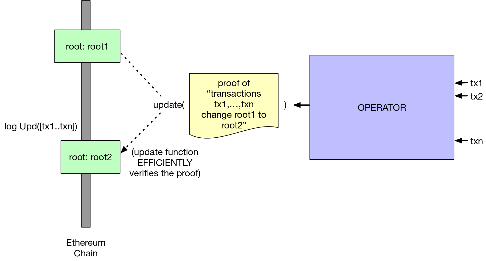
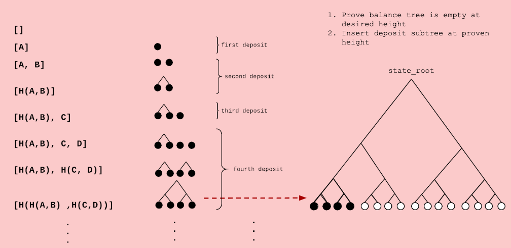
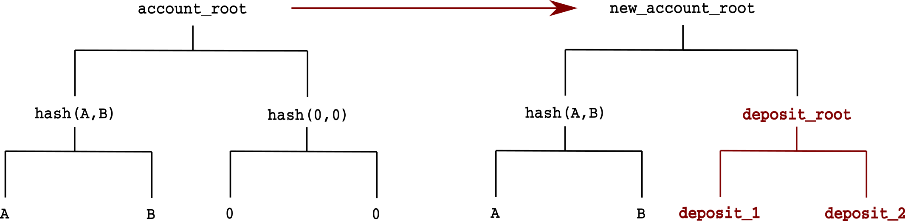

# simple-zk-rollup


## Prerequire:
- In order to run this tutorial, you need to install these following tools:
  * `zkutil` 
  * `circom`
  * `snarkjs` 
- After install these tools, run `npm install` to install the library that we use in this tutorial ( make sure that you have `nodejs` installed ).  
- We also assume that you have some basic knowledge about zero knowledge and cryptography. If you don't, check out these articles about zero knowledge:  
 \\ Techfi article  

## 1. Verify a simple circuit  
  In case you forgot a little bit about `circom` and what is it for, this example will remind you about that and also show you how to combine `zkutil`, `circom` and `snarkjs` to create a circuit and verify it. If you already familiar with `circom`, `snarkjs` and `zkutil` then you can skip this part.
  
  In this example, we will create a simple circuit that take two number **a** and **b** as inputs, multiply them together and assign the result to an output number **c**. The purpose of this example is to prove that someone knows 2 number **a** and **b** without reveal the value of it.  
  First, we have the circuit:   
  
  ```
  pragma circom 2.0.0;
   
  template Mutiplier(){
    signal input a;
    signal input b;
    signal output c;
    
    c <== a * b;  
  }
  
  component main = Multiplier();
  ```

  After finishing the circuit, we will come to `input.json`. Here we assign the value 9 for a and 7 for b (you can choose any value you like).
  `{"a": "9", "b": "7"}`
  
  Now, let's come to the next part where we compile the circuit, create the proof and verify it.
  
  To compile the circuit use : 
  `circom circuit.circom --wasm --r1cs --json`
  
  You will see 2 new file which is `circuit.r1cs` and `circuit_constraints.json` and a new folder `circuit_js`(for further convenient, you should copy all the file in this folder to the parent folder which is the `verify-simple-circuit` folder).
  
  Run `snarkjs calculatewitness` to calculate witness.  
  
  Using `zkutil` to setup parameter for the proving process, run : `zkutil setup`. You will see a new file `params.bin` pop up.  
  
  To create the proof, run : `zkutil prove` . This will create 2 new file `proof.json` and `public.json`   
  
  Now we will verify if the `proof.json` is a correct proof or not by running : `zkutil verify`. If it's correct you should see `Proof is correct` in your terminal.  
  
  If you want to generate a solidity smart contract to verify the proof on the blockchain, run. `zkutil generate-verifier`. This should create a `verifier.sol` file, which you can deploy to any EVM blockchain.
  
## 2. Verify an EdDSA signature

  EdDSA is a popular signature scheme that is widely used in ZK rollup. In this example, we will create a circuit to verify a EdDSA signalture scheme. Instead of rewriting whole circuit (which is very compicated and time consuming) we will use the `circomlib` library. It contain the EdDSA MiMC7 circuit and we just need to import it into our circuit in order to use it.
   
  `circuit.circom`:
  ```
  pragma circom 2.0.0;
  include "./node_modules/circomlib/circuits/eddsamimc.circom";

  component main = VerifyEdDSAMiMC();
``` 
  Generate inputs:
  `node generate_input`
  Compile circuit:
  `circom circuit.circom --wasm --r1cs --json`
  Setup parameter:
  `zkutil setup`
  Calculate witness:
  `snarkjs calculatewitness`
  Generate proof:
  `zkutil prove`
  Verify the proof:
  `zkutil verify`
  Generate on-chain verifier:
  `zkutil generate-verifier`
## 3. Verify a Merkle tree of accounts 
  Merkle tree is the data structure which is used on blockchain to store data, including accounts, transactions,etc. In this part, we will write a circuit to verify if an accounts was included in a Merkle tree or not. 
  
  DualMux (or Dual Multiplexer) is the first circuit that we need to consider. This circuit take 2 inputs and a selector (can only be 0 or 1). If selector = 1 then switch the position of the input, otherwise keep it the same.
  
  ```
  template DualMux(){
	signal input in[2];
	signal input s;

	signal output out[2];

	s*(s-1) === 0;

	out[0] <== (in[1] - in[0])*s + in[0];
	out[1] <== (in[0] - in[1])*s + in[1];

  }
  ```

We have GetMerkleRoot circuit to calculate the root of a Merkle Tree (this Merkle tree using MultiMiMC7 hash).

  ```
  template GetMerkleRoot(k){

// k is depth of tree

  signal input leaf;
  signal input paths2_root[k];
  signal input paths2_root_pos[k];

  signal output out;

  component selectors[k];

  component hashers[k];

  for(var i = 0; i < k; i++){

	selectors[i] = DualMux();
	selectors[i].in[0] <== i == 0 ? leaf : hashers[i-1].out;
	selectors[i].in[1] <== paths2_root[i];
	selectors[i].s <== paths2_root_pos[i];

	hashers[i] = MultiMiMC7(2,91);
	hashers[i].k <== 1;
	hashers[i].in[0] <== selectors[i].out[0];
	hashers[i].in[1] <== selectors[i].out[1];
  }

  out <== hashers[k-1].out;

}
```

After having the root calculator, we will check if a leaf (an account) with path to root belong to a Merkle tree with a given root.

```
pragma circom 2.0.0;
include "./get_merkle_root.circom";
include "../node_modules/circomlib/circuits/mimc.circom";

template LeafExistence(k){

// k is depth of the tree

signal input leaf;
signal input root;
signal input paths2_root_pos[k];
signal input paths2_root[k];

component computed_root = GetMerkleRoot(k);

computed_root.leaf <== leaf;

for (var w = 0; w < k; w++){
	computed_root.paths2_root[w] <== paths2_root[w];
	computed_root.paths2_root_pos[w] <== paths2_root_pos[w];

}
// equality constraint: input account root === computed account root

root === computed_root.out;

}

component main = LeafExistence(2);
```

## 4. Verify a single transaction

All state in a rollup chain is stored in a tree, whose root is kept on chain and can only be changed by submitting a snark proof which certifies valid state transitions off chain. For this tutorial, since we are doing ERC20 style transfers we can store user balance in the leaf of merkel tree. Let's find out more!


### Account format
Each account is represented by a single leaf in the accounts tree. It is calculated by hashing the following components in the following order:

` leaf = Hash(pubkey_x, pubkey_y, balance, nonce, token_type) `

The account is represented by the following inputs:
``` Js
class Account = {
	pubkey_x : public key X // (253 bits)
	pubkey_y : public key Y // (253 bits)
	balance: int // (128 bits)
	nonce: int // (32 bits)
	token_type: int // (32 bits)
}
```

But for the simplicity of this tutorial, we will use the minimal leaf structure:
```Js
class Account = {
	pubkey : eddsa_pubkey,
	balance : int 
} 
```


### Transaction 
For each SNARK, we construct a Transactions Merkle tree, whose leaves are the transactions processed by the SNARK.
``` Js
class Transaction = {
	from : eddsa_pubkey,
	fromIndex: int, // the index of the sender's in the accounts tree 
	to : eddsa_pubkey,
	amount: int,
	token_type: int
}
```

For the simplicity of this tutorial, we will use the minimal transaction structure:
``` Js
class Transaction = {
	from : eddsa_pubkey,
	to: eddsa_pubkey,
	amount: int
}
```

### Deposit to rollup
- Each deposit creates a leaf in the smart contract. The smart contract checks that the nonce, token_type and balance are correct. Anyone can aggregate these deposits into a deposit_tree with a deposit_root. 
- The coordinator can add these to the current balance tree by:
	- Proving that an empty_node at the same depth as the deposit_tree is empty in the account_tree.
	- Replacing this empty_node with the deposit_root.
	- Using the same Merkle proof to calculate the new account_root.




### Withdraw from rollup
- Withdrawing is like a normal transfer state transition. For withdraw users just have to send their tokens to `zero_address` which is like burning address for our chain. Tokens can only be received at this address.
	- Withdrawer sends a transaction to `zero_address`.
	- Withdraw() function can be called on the smart contract which does the following:
		- Verifies signature
		- Verifies the existence of a withdraw transaction
		- Transfer money from pool to specific address

### Processing a single transaction

In zkRollup processing a single transaction involves:
1. Checking that the sender account existence in the accounts tree.
2. Checking that the hash of the transaction was signed by the sender.
3. Debiting the sender account.
4. Update teh `accounts_root` to get `intermediate_root`.
5. Checking that the receiver accounts exist in the `intermediate_root`.
6. Crediting the receiver account.
7. Updating the `accounts_root` to get the `final_root`.

**Step 1: Initialize inputs and output signals**

``` 
template ProcessTx(k){
	// k is the depth of the accounts tree
	
	// accounts tree info
	signal input accounts_root;
	signal input intermediate_root;
	signal input accounts_pubkey[2**k][2];	
	signal input accounts_balance[2**k];
	
	// transactions info
	signal input sender_pubkey[2];
	signal input sender_balance;
	signal input receiver_pubkey[2];
	signal input receiver_balance;
	signal input amount;
	signal input signature_R8x;
	signal input signature_R8y;
	signal input signature_S;
	signal input sender_proof[k];
	signal input sender_proof_pos[k];
	signal input receiver_proof[k];
	signal input receiver_proof_pos[k];
	signal input enabled;
	
	// output
	signal output new_accounts_root;
	
	...
}

```

**Step 2: Check the sender exisitence**

To check the sender existence, we use the LeafExistence circuit from Part 3.

```
template ProcessTx(k){
...

// verify sender account exists in accounts_root

	component senderExistence = LeafExistence(k,3);
	
	senderExistence.preimage[0] <== sender_pubkey[0];
	senderExistence.preimage[1] <== sender_pubkey[1];
	senderExistence.preimage[2] <== sender_balance;
	senderExistence.root <== accounts_root;
	
	for(var i = 0; i < k; i++){
		senderExistence.paths2_root_pos[i] <== sender_proof_pos[i];
		senderExistence.paths2_root[i] <== sender_proof[i];
	}
	
...
}
```

**Step 3: Check the sender's signature**

To check the sender's signature, we use the EdDSAMiMCVerifier from the `circomlib` library. 

```
template ProcessTx(k){
...
	// hash msg

	component msg = MultiMiMC7(5,91);
	
	msg.k <== 1;
	msg.in[0] <== sender_pubkey[0];
	msg.in[1] <== sender_pubkey[1];
	msg.in[2] <== receiver_pubkey[0];
	msg.in[3] <== receiver_pubkey[1];
	msg.in[4] <== amount;
	
	// check that transaction was signed by sender
	
	component signatureCheck = EdDSAMiMCVerifier();
	
	signatureCheck.enabled <== enabled;
	signatureCheck.Ax <== sender_pubkey[0];
	signatureCheck.Ay <== sender_pubkey[1];
	signatureCheck.R8x <== signature_R8x;
	signatureCheck.R8y <== signature_R8y;
	signatureCheck.S <== signature_S;
	signatureCheck.M <== msg.out;

...
}
```

**Step 4: Debit sender account and calculate the intermediate root** 
We need to reduce balance of sender by amount he is trying to transfer, so if sender's balance was 100 before transfer of 10, after transfer it should be 90. Also hash the new account leaf using `MultiMiMC7` circuit template. After that we should be able to calculate the `intermediate_root` and compare it to the `intermediate_root` that we input.

```
template ProcessTx(k){
...
	// debit sender account and hash new sender leaf
	
	component newSenderLeaf = MultiMiMC7(3,91);
	
	newSenderLeaf.k <== 1;
	newSenderLeaf.in[0] <== sender_pubkey[0];
	newSenderLeaf.in[1] <== sender_pubkey[1];
	newSenderLeaf.in[2] <== (sender_balance - amount);
	
	component compute_intermediate_root = GetMerkleRoot(k);
	compute_intermediate_root.leaf <== newSenderLeaf.out;
	
	for(var i = 0; i < k; i++){
		compute_intermediate_root.paths2_root_pos[i] <== sender_proof_pos[i];
		compute_intermediate_root.paths2_root[i] <== sender_proof[i];
	}
	
	// check that computed_intermediate_root.out === intermediate_root

	compute_intermediate_root.out === intermediate_root;
...
}
```

**Step 5: Verify receiver account existence**

To proceed further with the transfer we need to first check if the receiver's leaf exists in the tree.

```
template ProcessTx(k){
...
	// verify receiver account exists in intermediate_root
	
	component receiverExistence = LeafExistence(k,3);
	
	receiverExistence.preimage[0] <== receiver_pubkey[0];
	receiverExistence.preimage[1] <== receiver_pubkey[1];
	receiverExistence.preimage[2] <== receiver_balance;
	receiverExistence.root <== intermediate_root;
	
	for(var i = 0; i < k; i++){
		receiverExistence.paths2_root_pos[i] <== receiver_proof_pos[i];
		receiverExistence.paths2_root[i] <== receiver_proof[i];	
	}

...
}
```

**Step 6: Credit receiver's account**

We need to update the receiver's account balance with the amount sent by sender. Also create a new leaf hash for updated account.

```
template ProcessTx(k){
...
// credit receiver account and hash new receiver leaf

	component newReceiverLeaf = MultiMiMC7(3,91);
	
	newReceiverLeaf.in[0] <== receiver_pubkey[0];
	newReceiverLeaf.in[1] <== receiver_pubkey[1];
	newReceiverLeaf.in[2] <== (receiver_balance + amount);
	newReceiverLeaf.k <== 1;
...
}
```

**Step 7: Update accounts root with the receiver's updated leaf**


```
template ProcessTx(k){
...
	// update accounts_root
	
	component compute_final_root = GetMerkleRoot(k);
	
	compute_final_root.leaf <== newReceiverLeaf.out;
	
	for(var i = 0; i < k; i++){
		compute_final_root.paths2_root_pos[i] <== receiver_proof_pos[i];
		compute_final_root.paths2_root[i] <== receiver_proof[i];
	}
	
	//output final accounts_root
	
	new_accounts_root <== compute_final_root.out;
...
}
```

The final circuit should look like `single_tx/circuit.circom`.

Congratulation, you have finish the tutorial to build a simple zk rollup. Even though this is far from a real zk rollup but it covers the main concept of how a zk rollup really works .I hope that after finish this tutorial, you have a better looks at how the zk rollup work. 
If you have any problem with the tutorial, feel free to reach me out at: 
- Discord : Tan Phan#9469
- Email : tanp.work@gmail.com 
